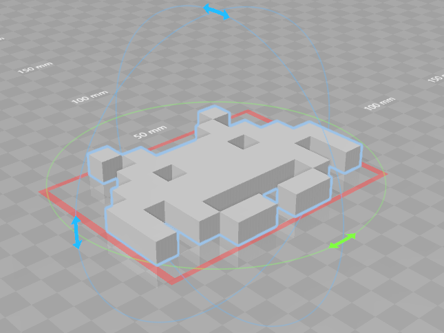

# 📚 SuperimposeMesh Library

A modern C++ augmented-reality library to superimpose 3D objects on images.

|   |
|------------|

[](https://robotology.github.io/superimpose-mesh-lib/doc/doxygen/html/index.html) [](https://github.com/robotology/superimpose-mesh-lib/releases)

[](http://semver.org/) [](https://zenhub.com)

[](https://travis-ci.org/robotology/superimpose-mesh-lib)
[](https://travis-ci.org/robotology/superimpose-mesh-lib)
[](https://ci.appveyor.com/project/robotology/superimpose-mesh-lib)
[](https://www.codacy.com/app/robotology/superimpose-mesh-lib?utm_source=github.com&amp;utm_medium=referral&amp;utm_content=robotology/superimpose-mesh-lib&amp;utm_campaign=Badge_Grade)

# Overview
- [⚠️ About versioning](#️-about-versioning)
- [📖 Background](#-background)
- [🎛 Dependencies](#-dependencies)
- [🔨 Build and link the library](#-build-and-link-the-library)
- [🔬 Test the library](#-test-the-library)
- [📝 API documentation and example code](#-api-documentation-and-example-code)


# ⚠️ About versioning
The project is undergoing _heavy_ development: APIs will be subject to changes quite often.
To be able to understand API compatibility during development, the project will follow [SemVer](http://semver.org/) specs.

In particular, the library will have **zero major version**, i.e. **0.MINOR.PATCH**, as specified by [SemVer spec. 4](http://semver.org/#spec-item-4) and the project will comply with the following rules:
1. **MINOR** version increases when API compatibility is broken;
2. **PATCH** version increases when functionality are added in a backwards-compatible manner;
3. Additional labels for pre-release and build metadata are available as extensions to the 0.MINOR.PATCH format.


# 📖 Background
This library provides superimposition facilities: the placement of one thing over another.
In particular, this library provides classes to superimpose 3D mesh model on top of an image that are of central importance for computer vision and augmented-reality applications.


# 🎛 Dependencies
SuperimposeMesh library depends on
- [YCM](https://github.com/robotology/ycm) - `version >= 0.10.2`
- [GLFW](http://www.glfw.org) - `version >= 3.1`, macOS: `brew --HEAD`
- [Open Asset Import Library, ASSIMP](http://assimp.org) - `version >= 3.3.0`
- [OpenGL Extension Wrangler, GLEW](http://glew.sourceforge.net) - `version >= 2.0`
- [OpenCV](http://opencv.org) - `version >= 2.4.9`
- [OpenGL Mathematics, GLM](http://glm.g-truc.net) - `version >= 0.9`


# 🔨 Build and link the library
Use the following commands to build, install and link the library.

### Build
With `make` facilities:
```bash
$ git clone https://github.com/robotology/superimpose-mesh-lib
$ cd superimpose-mesh-lib
$ mkdir build && cd build
$ cmake ..
$ make
$ [sudo] make install
```

With IDE build tool facilities:
```bash
$ git clone https://github.com/robotology/superimpose-mesh-lib
$ cd superimpose-mesh-lib
$ mkdir build && cd build
$ cmake ..
$ cmake --build . --target ALL_BUILD --config Release
$ cmake --build . --target INSTALL --config Release
```

### Link
Once the library is installed, you can link it using `CMake` with as little effort as writing the following line of code in your project's `CMakeLists.txt`:
```cmake
...
find_package(SuperimposeMesh 0.MINOR.PATCH EXACT REQUIRED)
...
target_link_libraries(<target> SuperimposeMesh::SuperimposeMesh)
...
```


# 🔬 Test the library
We have designed several tests using `CMake`'s `ctest` to check whether everything is running smoothly or not.
Simply run
```cmake
$ ctest [-VV]
```

Tests are also well-designed **starting points** to learn how to use the library and how to implement your own shaders! _Just have a look at them!_


# 📝 API documentation and example code
Doxygen-generated documentation is available [here](https://robotology.github.io/superimpose-mesh-lib/doc/doxygen/html/index.html).
